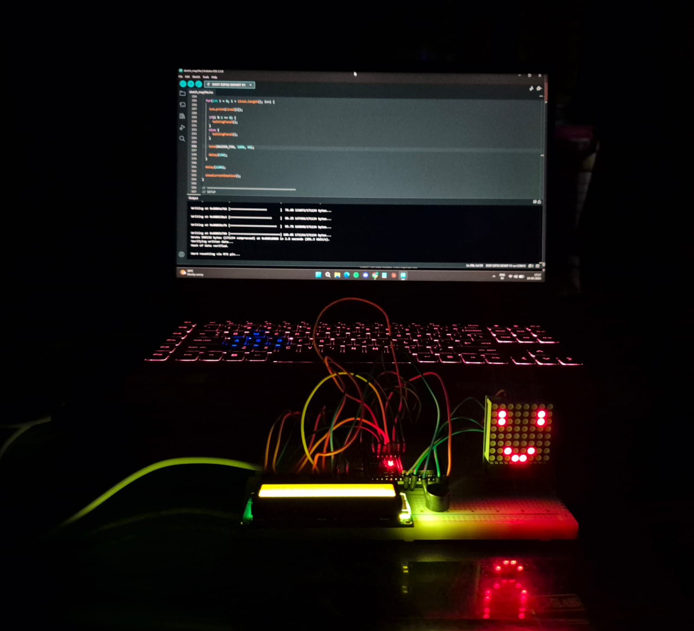
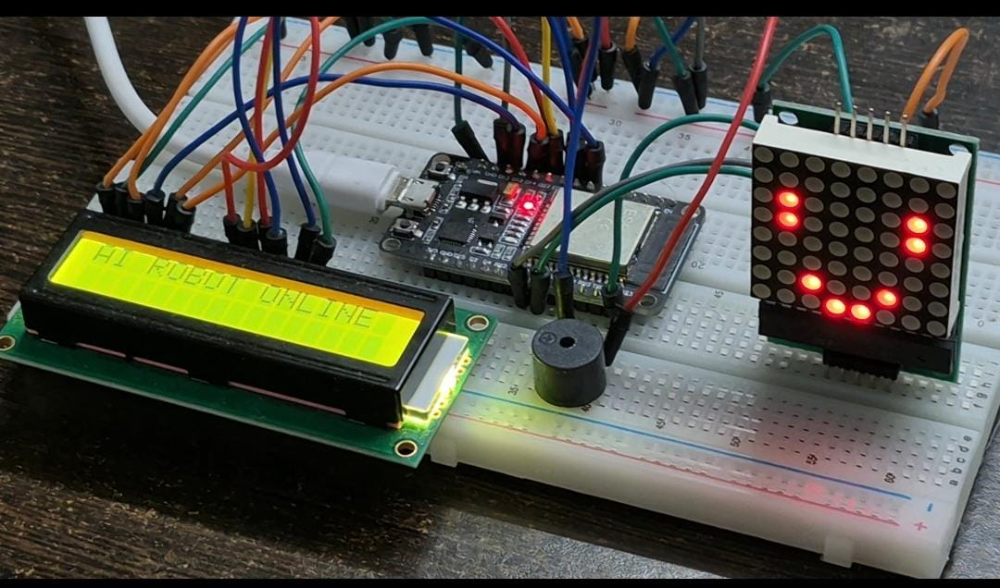

# FaceBot AI — Embedded System & Real-Time Serial Companion

An event-driven desktop companion combining an ESP32 microcontroller with a host-side Python runtime for real-time LLM inference, dynamic peripheral actuation, multi-modal audio processing, and serial state machine coordination.

---

## Hardware Demonstration

| Hardware Setup (Lit View) | Hardware Setup (Bench Testing) |
| :---: | :---: |
|  |  |

---

## Hardware & Peripheral Architecture

The system operates on a 32-bit Xtensa dual-core ESP32 microcontroller running non-blocking C++ firmware. 

* **Facial Expression Rendering:** Facial animations and emotion states (happy, angry, surprised, bored, sleeping) are rendered dynamically on an **8x8 MAX7219 LED Matrix**.
* **Text Communication Display:** Serial dialogue messages, responses, and system statuses are rendered character-by-character across a **16x2 HD44780 Parallel LCD Display**.
* **Audio Feedback & Speech Effects:** A dedicated active buzzer provides frequency-modulated audio feedback acting as dynamic sound effects during text typing and state transitions.
* **Serial Input Interface:** Supports direct user input from the serial monitor across any form of conversational statements, commands, or chat prompts.
* **Microphone Input Extension:** Integrated microphone sensor interface allowing speech-to-text translation for real-time voice input.
* **WebSocket & Cloud API Bridge:** Scaled to operate over a low-latency **WebSocket server**, connecting free online APIs for voice processing, speech translation, and dynamic emotion inference based on conversational context.

---

## Embedded Design Highlights

* **Deterministic State Machine:** Built on non-blocking `millis()` timing loops to eliminate CPU stall states during UART parsing, animation updates, or peripheral toggles.
* **Low-Power State Transitions:** Implements dynamic hardware power-down modes. Upon entering the SLEEP state, timer interrupts detach the PWM servo driver (eliminating holding torque jitter) and disable the LCD backlight driver.
* **Stream-Based Serial Parser:** Delimits incoming UART frames over USB at 115200 Baud using a custom `[COMMAND]:[PAYLOAD]` protocol parser with automated buffer clearing.
* **Synchronized Actuation Dynamics:** Interleaved execution pipelines sync character-by-character LCD text rendering with 8x8 LED matrix frame shifting, servo angle manipulation, and frequency-modulated active buzzer feedback.

---

## System Pin Mapping & Interface Matrix

| Peripheral Module | Physical Interface | ESP32 GPIO | Operating Parameters |
| :--- | :--- | :--- | :--- |
| **MAX7219 Matrix CS** | SPI (Software/Hardware) | GPIO 5 | Active LOW |
| **MAX7219 Matrix CLK** | SPI Clock | GPIO 18 | Hardware SPI Bus |
| **MAX7219 Matrix DIN** | SPI MOSI | GPIO 23 | Bit-banged / Hardware MOSI |
| **SG90 Servo Motor** | PWM Signal | GPIO 32 | 50 Hz, 0.5ms–2.5ms Pulse Width |
| **Active Buzzer** | Direct Digital / Tone | GPIO 33 | Frequency Sweep Modulation |
| **HD44780 LCD RS** | Parallel Control | GPIO 13 | Register Select |
| **HD44780 LCD Enable** | Parallel Control | GPIO 12 | Strobe Bit |
| **HD44780 LCD Data** | 4-Bit Parallel Bus | GPIO 14, 27, 26, 25 | Nibble Mode Bus Integration |

---

## Installation & Build Pipeline

### Firmware Compiling (ESP32)
1. Open the project root in VS Code with PlatformIO or Arduino IDE configured for ESP32.
2. Ensure required C++ driver libraries are installed: `MD_MAX72xx`, `LiquidCrystal`, `ESP32Servo`.
3. Flash `firmware/src/main.cpp` via target USB/UART port (115200 Baud).

### Python Host Runtime
1. Navigate to the host directory and install dependencies:
   cd python_host
   pip install -r requirements.txt
2. Configure environment credentials:
   export GEMINI_API_KEY="your-api-key"
3. Run the communication bridge:
   python main.py

---

## Repository Structure

facebot-ai/
├── firmware/
│   └── src/
│       └── main.cpp          # Non-blocking C++ State Machine & Peripheral Drivers
├── python_host/
│   ├── main.py               # Serial protocol encoding & Gemini LLM Runtime
│   └── requirements.txt      # Python runtime dependencies
├── docs/
│   └── hardware_setup.md     # Wiring schematic & interface specifications
├── img1.jpeg                 # Hardware Setup Photograph
├── img2.jpeg                 # Hardware Bench Test Photograph
├── .gitignore                # Target build & key isolation
└── README.md                 # System Architecture Datasheet